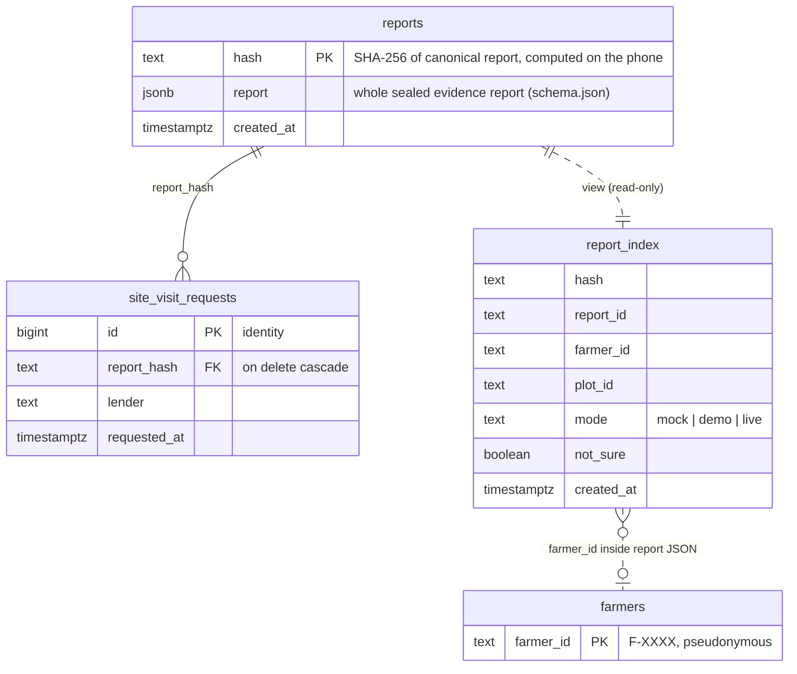
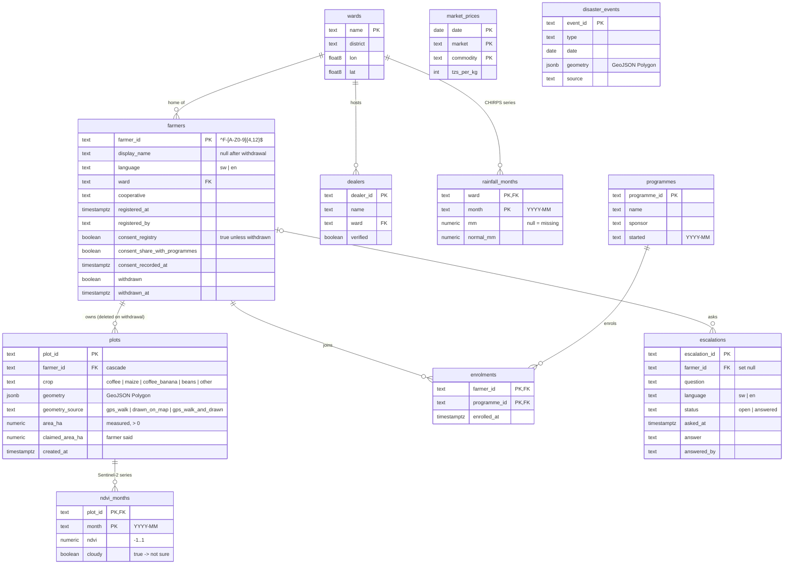
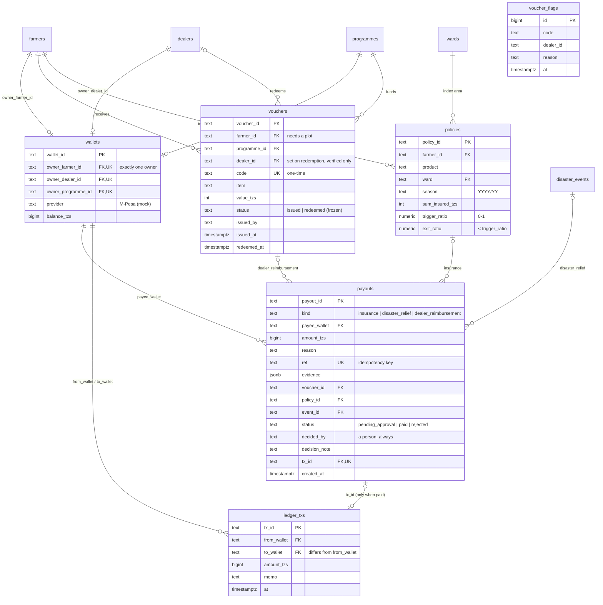
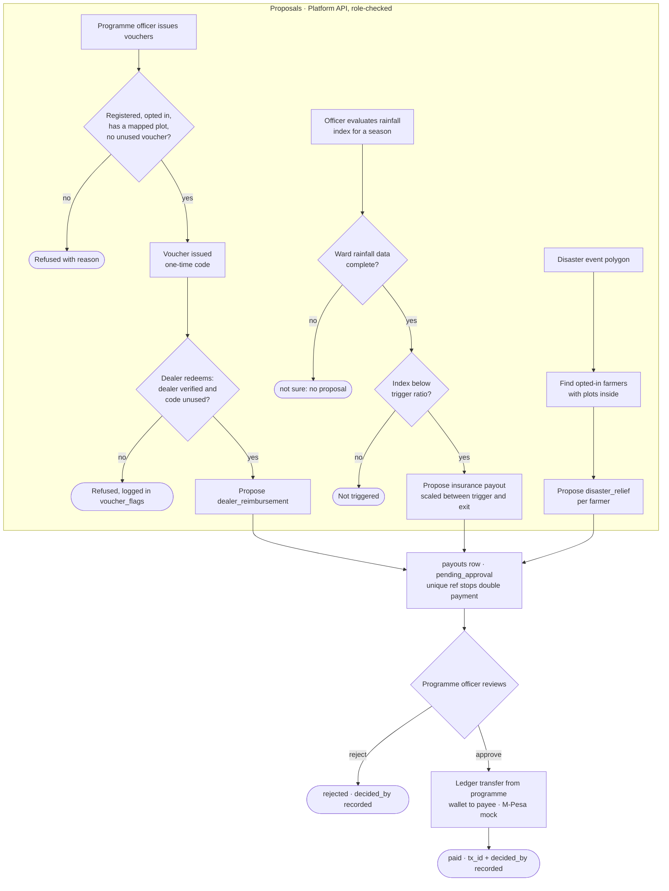
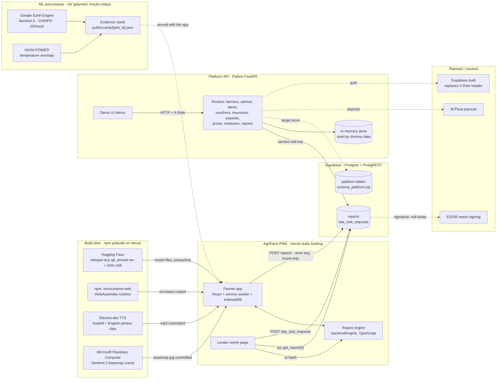

# AgriFarm system diagrams

Mermaid sources for the ERD, process flows and integration map, drawn from the code on `main` (as of `8bfd120`). GitHub renders them on this page. Planned and mocked parts are labelled.

Contents: [ERD](#1-entity-relationship-diagram) · [Process flow](#2-process-flow) · [Integration map](#3-integration-map)

## 1. Entity-relationship diagram

19 tables and one view in Supabase Postgres, from [`../schema.sql`](../schema.sql) and [`../schema_platform.sql`](../schema_platform.sql). Split into three groups; shared tables appear by name only where they repeat. Dotted lines are not foreign keys. Rules and access are described in [`SCHEMA.md`](SCHEMA.md).

### A. Evidence reports (live, `schema.sql`)

### B. Farmers, land and climate (`schema_platform.sql`)

### C. Vouchers, insurance and payments (`schema_platform.sql`)

## 2. Process flow

Diamonds are decisions; rounded boxes are end states.

### A. Evidence report: farmer to lender

`app/src/capture/Flow.tsx` → `backend/engine` → `app/src/data/reports.ts` → `app/src/lender/Verify.tsx`

```mermaid
flowchart TD
    subgraph PHONE["Farmer's phone · PWA, works in airplane mode · state saved to IndexedDB after every step"]
        S([Open app]) --> C1{"1 · Consent<br/>Swahili audio, tap"}
        C1 -- declines --> X1([Nothing recorded])
        C1 -- agrees --> SP["2 · Speak ~2 min<br/>whisper-tiny ASR on device<br/>raw audio discarded after"]
        SP --> EX["Rule-based Swahili extraction<br/>crop · ekari/hekta · years · seasons"]
        EX --> CF{"3 · Confirm each value<br/>by tap"}
        CF -- "wrong / not heard" --> TAP["Farmer enters value by tap"] --> CF
        CF -- confirmed --> PL["4 · Plot<br/>walk with GPS or draw on offline map"]
        PL --> MR{"Matches a cooperative-<br/>registered plot? (20 m)"}
        MR -- yes --> EC["Load precomputed evidence card<br/>NDVI · CHIRPS · NASA POWER · soil"]
        MR -- no --> NC["No card: satellite and rain<br/>checks become 'could not be checked'"]
        EC --> PH
        NC --> PH
        PH{"5 · Photos<br/>inside plot boundary?"}
        PH -- no --> RJ["Rejected, retake"] --> PH
        PH -- yes --> TA["Turn-around photo<br/>freshness + dHash duplicate check"]
        TA --> BR["6 · Build report offline<br/>rule engine: crop · area · rain · heat · tenure"]
        BR --> NS{"Anything the machine<br/>could not decide?"}
        NS -- yes --> NSF["not_sure flag:<br/>'ask a person before sharing'"] --> RV
        NS -- no --> RV["Farmer hears the report<br/>in Swahili, fixed phrase list"]
        RV --> SH{"Share with a lender?"}
        SH -- no --> KEEP([Report stays on the phone,<br/>can be deleted])
        SH -- yes --> SEAL["Seal: SHA-256 of canonical JSON<br/>QR = /verify#r=id&h=hash"]
        SEAL --> OB["Queue in outbox"]
    end
    subgraph NET["When a connection exists"]
        OB --> ON{"Online?"}
        ON -- "no, wait for 'online'" --> ON
        ON -- yes --> UP["POST reports to Supabase<br/>anon key, insert-only"]
    end
    subgraph LENDER["Loan officer · /verify page"]
        QR([Scans farmer's QR]) --> GR["get_report(h) RPC"]
        UP -.-> GR
        GR --> FOUND{"Report found?"}
        FOUND -- no --> NF([Not found / unreachable])
        FOUND -- yes --> RH{"Re-hash matches<br/>hash in the QR?"}
        RH -- no --> ALT(["Does not match:<br/>report was altered"])
        RH -- yes --> OK["Unaltered: contradictions first,<br/>then evidence, then limits"]
        OK --> DEC{"A person decides"}
        DEC -- "needs checking" --> SV["Request site visit<br/>insert site_visit_requests"]
        DEC -- "enough evidence" --> DONE([Lender's own decision])
    end
```

### B. Programme payouts: proposal, then a person approves

`backend/agrifarm_api/routers/`: `vouchers`, `insurance`, `institution`, `payments`

## 3. Integration map

Solid lines run today; dotted lines are planned or mocked. Build-time sources never run on the farmer's phone: their output ships inside the app so it works offline.

| Integration | Direction | When | Credentials | Status | Where in code |
|---|---|---|---|---|---|
| Supabase `reports` | Farmer app → Supabase | Runtime, when online (outbox retries) | Anon key; RLS insert only | Live | `app/src/data/reports.ts` |
| Supabase `get_report(h)` | Lender page → Supabase | Runtime | Anon key; security-definer function | Live | `app/src/data/reports.ts`, `schema.sql` |
| Supabase `site_visit_requests` | Lender page → Supabase | Runtime | Anon key; insert only | Live | `app/src/lender/Verify.tsx` |
| Supabase service role | Platform API → Supabase | Runtime | `SUPABASE_SERVICE_ROLE_KEY`, backend only | Live when configured | `backend/agrifarm_api/routers/reports.py` |
| Supabase platform tables | Platform API → Supabase | Runtime | Service role; RLS on, no public policies | Schema ready; API still in memory | `schema_platform.sql`, `backend/agrifarm_api/store.py` |
| Hugging Face | Build → `app/public/models` | npm prebuild | None; pinned revision `ff41770` + SHA-256 | Live | `app/scripts/fetch-models.ts` |
| onnxruntime-web (npm) | `node_modules` → `app/public/ort` | npm prebuild | None | Live | `app/scripts/fetch-models.ts` |
| ElevenLabs TTS | Script → `app/public/audio` | Manual, build time | `ELEVENLABS_API_KEY` | Clips committed | `app/scripts/generate-audio.ts` |
| Microsoft Planetary Computer | Script → `app/public/map` | Manual, build time | None | Scene committed | `app/scripts/fetch-basemap.ts` |
| Vercel | Hosts the PWA and `/verify` | Deploy | Project settings | Live | `app/vercel.json` |
| Google Earth Engine (Sentinel-2, CHIRPS, iSDAsoil) | `ml/` → evidence cards | Offline batch | `EE_PROJECT` + service-account key | Planned; mocks today | `ml/`, `app/src/data/cards.ts` |
| NASA POWER | `ml/` → evidence cards | Offline batch | None | Planned; mocks today | `docs/DATA_SOURCES.md` |
| M-Pesa | Platform API → payee wallets | On payout approval | — | Mock ledger | `backend/agrifarm_api/routers/payments.py` |
| Supabase Auth | Platform API roles | Runtime | — | Planned; `X-Role` header today | `backend/agrifarm_api/auth.py` |
| ES256 report signing | Backend → `integrity.signature` | On sync | `REPORT_SIGNING_PRIVATE_KEY_B64` | Planned; signature is `null` | `backend/engine/index.ts` |
