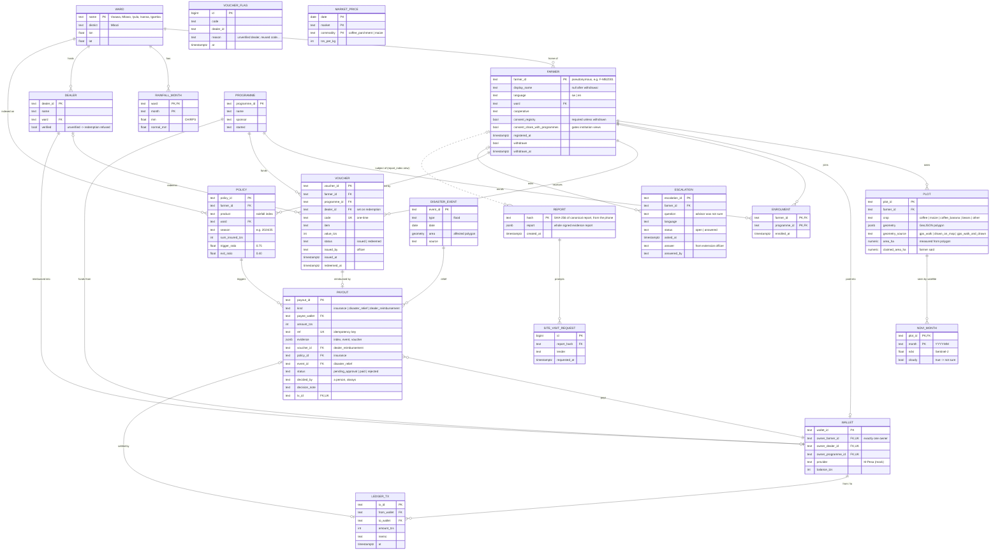

# AgriFarm data schema

Two stores:

- **Supabase (live):** `reports` and `site_visit_requests`, the verified farm evidence reports and lender requests. Defined in [`../schema.sql`](../schema.sql).
- **Platform tables:** everything else. Defined in [`../schema_platform.sql`](../schema_platform.sql); the API still serves them from memory with dummy data seeded by [`../backend/agrifarm_api/seed.py`](../backend/agrifarm_api/seed.py), and that seed loads into these tables unchanged. Lists in memory (for example `farmers.programmes`) are proper join tables here.

`schema_platform.sql` is additive: it never drops or alters `reports`, `site_visit_requests` or `get_report()`, and every statement is idempotent, so it can be run on the live Supabase project (and run again) without touching existing data. `schema.sql` stays as it is on `main`.

Vocabularies are shared with the evidence report contract ([`schema.json`](schema.json)), so a platform farmer or plot and a report about it agree:

| Field | Platform tables | `schema.json` |
|---|---|---|
| Farmer ID | `farmers.farmer_id` checked against `^F-[A-Z0-9]{4,12}$` | `farmer.farmer_id`, same pattern |
| Language | `sw` \| `en` | `farmer_language` |
| Crop | `coffee`, `maize`, `coffee_banana`, `beans`, `other` | `crop_type` values (`beans` is platform-only) |
| Plot shape | `plots.geometry`: GeoJSON Polygon, `[lon, lat]`, as `jsonb` (no PostGIS needed) | `plot.geometry` |
| How the boundary was captured | `plots.geometry_source`: `gps_walk` \| `drawn_on_map` \| `gps_walk_and_drawn` (the API's `walked` = `gps_walk`) | `plot.geometry_source` |
| Season / month | `YYYY/YY` / `YYYY-MM` | rainfall seasons / NDVI months |

`report_index` is a read-only view over `reports` (report ID, farmer ID, plot ID, mode, not-sure flag) for joining reports to `farmers`. It uses `security_invoker`, so the reports RLS still applies and the anon key can't list reports through it.

Access: RLS is on for every platform table, with no anon or authenticated policies. Only the platform API, using the service-role key, can read or write them.

## Entity-relationship diagram

`MARKET_PRICE` and `VOUCHER_FLAG` stand alone: prices are a reference series, and flags log refused redemptions, keyed by whatever code was tried.

## Rules the schema encodes

| Rule | Where |
|---|---|
| A farmer can't register without consent | check: `consent_registry` must be true unless withdrawn |
| Institutions see only opted-in farmers, never names | `FARMER.consent_share_with_programmes` filters every `/institution` view |
| No vouchers for ghosts | trigger `vouchers_rules`: a new `VOUCHER` needs the farmer to have at least one `PLOT` and not be withdrawn |
| Vouchers are redeemed only at verified dealers, and only once | trigger `vouchers_rules` checks `DEALER.verified` and freezes a redeemed voucher; `VOUCHER.code` unique |
| Money moves only after a person approves | check: `pending_approval` has no `decided_by` or `tx_id`; `paid` needs both; `rejected` needs `decided_by` |
| Re-running insurance doesn't pay twice | `PAYOUT.ref` unique, e.g. `ins:POL-009:2024/25` |
| A cloudy image gives "not sure", not a guess | `NDVI_MONTH.cloudy` |
| Evidence reports are tamper-evident | `REPORT.hash` is computed on the phone; the lender page re-hashes |
| Withdrawal erases personal data | check: a withdrawn farmer has no name, cooperative or consent; trigger `farmers_withdrawal` deletes their `PLOT` rows (and NDVI series); payment history kept for audit |
| A wallet has one owner | check: exactly one of `owner_farmer_id`, `owner_dealer_id`, `owner_programme_id` |
