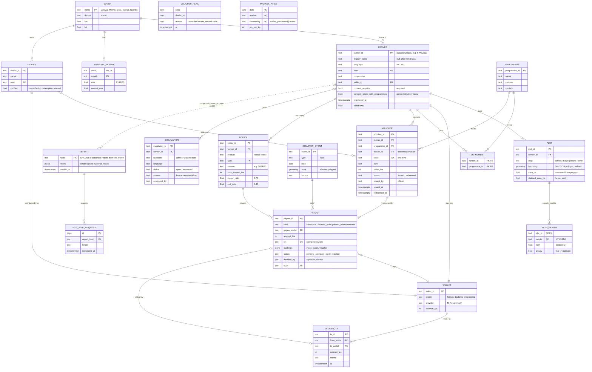

# AgriFarm data schema

Two stores:

- **Supabase (live):** `reports` and `site_visit_requests`, the verified farm evidence reports and lender requests. Defined in [`../schema.sql`](../schema.sql).
- **Platform API (in memory, dummy data):** everything else, seeded by [`../backend/agrifarm_api/seed.py`](../backend/agrifarm_api/seed.py). The diagram shows the shape these tables would take if they moved to Supabase/PostGIS. Some links are lists in memory today (for example `farmers.programmes`), and the diagram draws them as proper join tables.

## Entity-relationship diagram

`MARKET_PRICE` and `VOUCHER_FLAG` stand alone: prices are a reference series, and flags log refused redemptions, keyed by whatever code was tried.

## Rules the schema encodes

| Rule | Where |
|---|---|
| A farmer can't register without consent | `FARMER.consent_registry` must be true |
| Institutions see only opted-in farmers, never names | `FARMER.consent_share_with_programmes` filters every `/institution` view |
| No vouchers for ghosts | a `VOUCHER` needs the farmer to have at least one `PLOT` |
| Vouchers are redeemed only at verified dealers, and only once | `DEALER.verified`, `VOUCHER.code` unique, `status` |
| Money moves only after a person approves | `PAYOUT.status` starts at `pending_approval`; a `LEDGER_TX` exists only after approval, recorded in `decided_by` |
| Re-running insurance doesn't pay twice | `PAYOUT.ref` unique, e.g. `ins:POL-009:2024/25` |
| A cloudy image gives "not sure", not a guess | `NDVI_MONTH.cloudy` |
| Evidence reports are tamper-evident | `REPORT.hash` is computed on the phone; the lender page re-hashes |
| Withdrawal erases personal data | `FARMER.display_name` set to null, the farmer's `PLOT` rows deleted, `withdrawn` set; payment history kept for audit |
